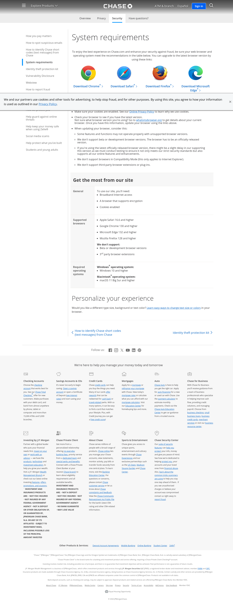
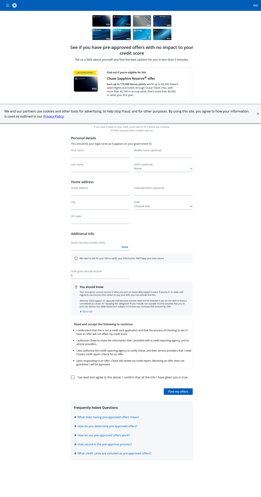

## README.md

```markdown
# AgentCore Browser User-Agent Workaround

This repository contains example code demonstrating a browser compatibility issue that can occur when using Amazon Bedrock AgentCore Browser with certain websites, and provides a workaround solution.

## Overview

The AgentCore Browser includes an AWS identifier in its User-Agent string for transparency and compliance purposes. Some websites with strict bot detection may show browser compatibility warnings when they encounter this identifier, even though the AgentCore Browser runs the latest version of Chrome.

## Prerequisites

- AWS account with credentials configured
- Python 3.10 or higher
- IAM permissions for Bedrock AgentCore Browser
- Required Python packages:
  ```bash
  pip install bedrock-agentcore playwright
  ```

## Files

- `replicate_browser_issue.py` - Demonstrates the browser compatibility issue
- `workaround_browser_issue.py` - Provides a workaround using CDP to override the User-Agent
- `chase_blocked.png` - Screenshot showing the browser compatibility warning
- `chase_working.png` - Screenshot showing successful page load after applying workaround

## Usage

Run the replication script to see the issue:
```bash
python replicate_browser_issue.py
```

This will generate a screenshot (`chase_blocked.png`) showing the browser compatibility warning:



Run the workaround script to bypass the compatibility warning:
```bash
python workaround_browser_issue.py
```

This will generate a screenshot (`chase_working.png`) showing the page loading successfully:



## Important Notes

The workaround removes the AWS identifier from the User-Agent string. Before using this approach in production, consider:
- Your organization's policies regarding browser identification
- The target website's Terms of Service
- Whether transparent identification of automated traffic is required for your use case

## Related Documentation

- [AgentCore Browser Documentation](https://docs.aws.amazon.com/bedrock-agentcore/latest/devguide/browser-tool.html)
- [Playwright Documentation](https://playwright.dev/python/)
```
